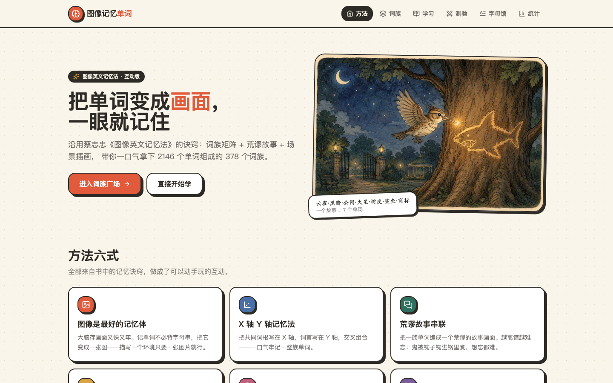
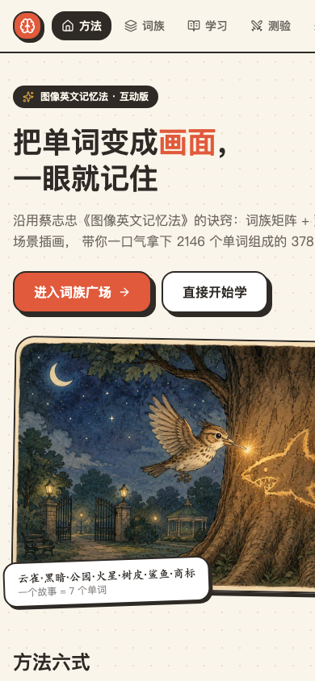
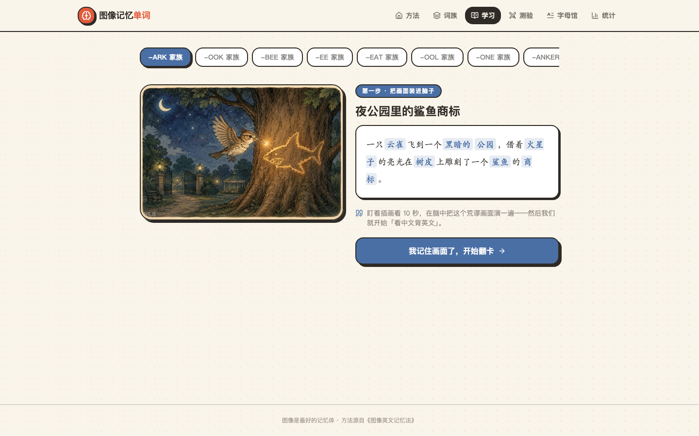

# 图像英文记忆法 · 互动版

> 把单词变成画面，一眼就记住。

一个基于蔡志忠《图像英文记忆法》的互动背单词应用。它不靠死记硬背，而是用
**场景插画 + 词族矩阵 + 荒谬故事 + 字母象形**，带你把成族的单词"一锅端"。

- 线上地址：<https://chengbin.vip/word-memory/>
- 源码仓库：<https://github.com/mrzhanggit/word-memory>

---

## 这个项目是干什么的

学英文最怕"背了就忘"。这个应用把《图像英文记忆法》里的记忆诀窍做成了
可以动手玩的网页：目前内置 **185 个词族、807 个核心单词**，每个词族都配有一张
场景插画和一段"荒谬故事"，让你顺着画面把一整族单词一起记住。

它主要面向：

- 想换个更有趣、更"记得住"的方式背单词的人；
- 被传统单词书"字母串"劝退、更需要画面感的学习者；
- 想利用碎片时间在手机上随时学一点的人。

---

## 设计原理 / 方法

全部方法来自蔡志忠《图像英文记忆法》，应用首页也概括为"方法六式"：

1. **图像是最好的记忆体** —— 大脑存画面又快又牢。记单词不必背字母串，把它变成一张图：描写一个环境，只要一张图片就行。
2. **X 轴 Y 轴记忆法（词族矩阵）** —— 把共同词根写在 X 轴、词首写在 Y 轴，交叉组合，一口气牢记一整族单词（如 `-ark` 家族：lark / dark / park / spark / bark / shark / mark）。
3. **荒谬故事串联** —— 把一族单词编进一个荒谬的故事画面，越离谱越难忘（鬼被钩子钩进锅里煮，想忘都难）。
4. **字母也会演戏** —— A 是屋脊、C 是娥眉月、X 是两剑交锋，而 bed 本身就是一张床，字母形里藏着意思。
5. **以熟带新** —— 借最熟的 `book` 带走 `look`、`cook`、`brook`…… 认识一个词，就等于认识了一窝词。
6. **看中文背英文** —— 回忆路线是：画面 → 中文意思 → 英文单词。测验就顺着这条路走，单词自然脱口而出。

> 核心理念：**用"画面 + 故事"替代"字母串 + 重复"**，把机械记忆升级为形象记忆。

---

## 主要功能页

应用共有 7 个页面（移动端友好，手机浏览器直接打开即可使用）：

| 页面 | 路由 | 作用 |
| --- | --- | --- |
| 首页 | `/` | 方法六式介绍 + 词族速览，进入起点 |
| 词族广场 | `/families` | 185 个词族卡片网格，按韵脚（词族）着色 |
| 词族详情 | `/family/:id` | 场景插画 + 荒谬故事串 + 单词表（含词首、音、义） |
| 学习 | `/study` | 逐词学习模式，跟着画面过单词 |
| 测验 | `/quiz` | 看中文回忆英文，沿"画面→中文→英文"路线巩固 |
| 字母法 | `/letters` | 字母象形讲解（A=屋脊、C=娥眉月、X=两剑……） |
| 统计 | `/stats` | 已接触 / 已掌握单词数、学习进度 |

### 页面截图

**首页（桌面端）** —— 方法六式介绍与词族速览入口：



**移动端首页** —— 手机浏览器自动适配，随时随地背单词：



**学习页** —— 跟着画面逐词学习：



> 其余功能页（词族广场、词族详情、测验、字母法、统计）的界面布局与交互，
> 请见上方「主要功能页」表格与说明。

---

## 主要特色

- **画面即记忆**：每个词族一幅场景插画，把抽象单词变成具体画面。
- **词族矩阵（XY 轴）**：不是孤立背词，而是按词根/词族成组记忆，效率更高。
- **荒谬故事串联**：用离谱故事把一族词绑在一起，记得牢、想得起。
- **字母象形**：把字母当画看（bed=床、A=屋脊），破解"字母串记不住"的难题。
- **看中文背英文**：测验路线贴合大脑真实回忆路径，学以致用。
- **进度本地持久化**：学习/掌握情况存于浏览器 `localStorage`，刷新不丢失。
- **纯前端 + 响应式**：无后端依赖，手机、平板、电脑都能用；已部署到 GitHub Pages。
- **开源可改**：数据以清晰的 TS 结构组织，新增词族/单词只需改数据文件。

---

## 和市面上的背单词软件有什么不同

| 维度 | 常见背单词 App（百词斩 / 墨墨 / 不背单词 / Anki 等） | 本项目 |
| --- | --- | --- |
| 记忆核心 | 单词卡 + 间隔重复 + 例句/音频 | **画面 + 故事 + 词族矩阵**，源自图像记忆法 |
| 记词单位 | 单个单词 | **成族记忆**（一词带动一窝，以熟带新） |
| 字母处理 | 当作拼音符号死记 | **字母象形**，把字母当画看 |
| 回忆路径 | 看词选义 / 听音写词 | **画面 → 中文 → 英文**，贴合形象记忆 |
| 内容来源 | 词典式词库 | 蔡志忠《图像英文记忆法》体系化方法 |
| 定位 | 通用背词工具 | 方法论驱动的兴趣/方法型学习 |

> 简言之：多数软件帮你"重复"，这个应用帮你"成像"。它不追求词库最大，
> 而是把"怎么记得住"这件事本身做成产品。

---

## 技术栈

- **React 19** + **TypeScript**
- **Vite 7** 构建
- **Tailwind CSS v3** + **shadcn/ui** 组件体系
- **react-router v7**（HashRouter，便于在子路径 / 静态托管下部署）
- 纯前端，无后端；进度存于 `localStorage`

---

## 本地运行

```bash
npm install
npm run dev        # 本地预览：http://localhost:3000
```

构建（如需部署到子路径，例如 GitHub Pages 项目页 `/word-memory/`）：

```bash
VITE_BASE=/word-memory/ npm run build -- --outDir dist
```

产物为纯静态文件，可直接托管到任意静态服务器或 GitHub Pages。

---

## 目录结构（节选）

```
src/
  data/            # 词族与单词数据（families-batch1~9.ts + 聚合 families.ts）
  pages/           # 7 个功能页（Home / Families / FamilyDetail / Study / Quiz / Letters / Stats）
  components/      # UI 组件（shadcn/ui + 业务组件）
  lib/sceneUrl.ts  # 场景图 URL 统一解析（适配子路径部署）
  hooks/           # 进度等自定义 hooks
public/scenes/     # 场景插画（jpg / png）
```

---

## 许可证

本项目用于学习与分享蔡志忠《图像英文记忆法》的记忆方法。插画与内容版权归原作者所有，
如需商用请联系权利方。
